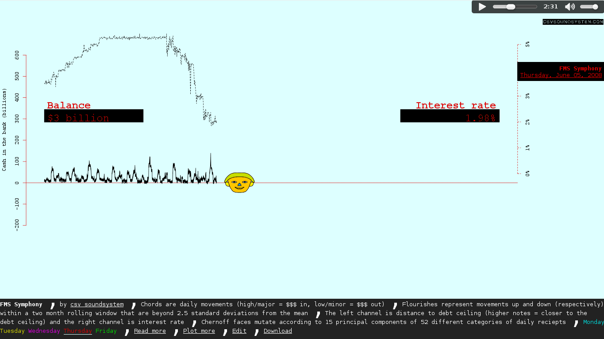

<style>p.comment { display: none; }</style>
# Multisensory data experiences
<!-- For the Zipfian Academy July 2 class -->
Thomas Levine ([thomaslevine.com](http://thomaslevine.com)),

CSV Soundsystem ([csvsoundsystem.com](http://csvsoundsystem.com))

[tlevine.github.io/multisensory-data-zipfian](http://tlevine.github.io/multisensory-data-zipfian)


## Information overload

<p class="comment">
  Today, we produce more information than we can handle.
  To cope with this, we data scientists convert this information
  to structured data that we can make sense of in a more
  automated way.
</p>


## Big data
[](https://twitter.com/mysqlborat/status/306078371182428161)
<p class="comment">
  That helps, but now we have to deal with all of these data.
  We need new tools to help us with these data.
</p>
<p class="comment">
  In previous classes, you've learned about tools for
  storing insane quantities of data and running calculations
  on all of the data. We need more tools like that, but
  we also need new tools for exploring and presenting data.
</p>


## Data table
```
Special Operations,2005,2006,2007,2008,2009,Total
Emergency Service,0%,0%,1%,1%,0%,2%
Harbor Unit,0%,0%,0%,0%,0%,0%
Aviation Unit,0%,0%,0%,0%,0%,0%
Taxi Unit,0%,0%,0%,0%,0%,0%
Canine Unit,0%,0%,0%,0%,0%,0%
Mounted Unit,0%,0%,0%,0%,0%,0%
Headquarters,0%,0%,0%,0%,0%,0%
Special Operations Division Total,0%,0%,1%,1%,0%,2%
Percent of All Subject Officers Against Whom Allegations were Substantiated,0%,0%,0.2%,0.3%,0%,0.1%
```
<p class="comment">
  A standard data visualization tool is the data table.
  At CSV Soundsystem, we prefer CSV files.
  As MySQL borat suggests, we could just make bigger tables.
  Tables are great for finding specific values,
  but it takes a long time to spot broader trends in tables.
</p>
<p class="comment">
  This is a table of complaints against New York City police officers, I think.
  It's small enough that it fits on the screen and that
  we can get the general picture that most values are, but
  this wouldn't work for larger tables.
</p>


## Graphs
[](http://www.theatlanticcities.com/commute/2013/05/visualizing-impact-mega-storms-transit/5660/)
<p class="comment">
  So we make graphs.
  If you listen to Tufte, you will use graphs to present data in a
  multivariate way and to present the relationships among different variables.
</p>
<p class="comment">
  Let's talk more about multivariate systems.
  If you have a lot of variables, it's hard to think about all of them at once.
  Instead of doing that, we think of all of these variables as one concept.
  We can use statistical methods to convert many variables into one, or we can
  use data visualization methods to represent many variables at once.
</p>
<p class="comment">
  When we're analyzing a multivariate system, we can first look at the
  collective trend across all of the variables without worrying about the
  specific changes.
</p>
<p class="comment">
  This graph depicts the turns of New York subway turnstiles. This graph
  represents about four varibles: Date, year, subway stop, and number of
  turnstile entries per day. For the past three years, New York city has had
  one pretty big storm per year, each of them in the fall. The red lines
  are the dates of these storms, and the x axis is the date relative the
  storm, going from three weeks before the storm to three weeks after the storm.
  The y axis is the number of times a person entered a subway station each day,
  and each line is a different subway station. The first panel is for the 2010
  microburst, the second is for the 2011 Huricane Irene, and the third is for
  the 2012 Hurricane Sandy.
</p>
<p class="comment">
  Let's get back to our discussion of multivariate data. We are looking at
  four variables, but we are thinking about them as one concept.
</p>
<p class="comment">
  Look at these bumps that happen about five times per line.
  When I look at these, I'm not noticing the individual lines or the individual
  dates; I'm just noticing that there's some pattern.
  Now that we've found some broader pattern, let's focus on it and start
  picking apart the individual variables. Looking at the date variable, I see that
  this bump happens every seven days, so it might be the weekend. I guess people
  use the subway less on weekends. Looking at the subway station variable
  (the different lines), I notice that this bump happens across most stations.
  I also notice that some stations drop really low. That might be an error, or
  it might be that the stations or closed for maintenance. Or something else.
</p>
<p class="comment">
  Now let's look at the elephant in the room that I've been ignoring.
  We've noticed some pattern in the multivariate system; the lines are mostly
  straight, with these bumps on the weekends. But this pattern gets inturrupted
  at the red line. What's going on there? 
  Well that line is the date of the storms.
  Subway stations got shut during the storms, and that explains the drops
  in ridership.
  But when we look more closely, we see what might be errors in the data.
  These lines going straight across might be missing data for those days
  that should be represented as zero riders.
</p>
<p class="comment">
  You probably didn't need my narration in order to read this graph;
  I explain it like this to convey this approach of aggregating multivariate
  data. First, we looked for broader trends without focusing on specific
  variables. Then, once we identified an interesting trend, we iteratively
  focused on interesting subsets and interesting variables.
  This is related to a concept of hierarchy from graphic design; if you make
  one thing really big, people will know what to look at first, and then they
  can focus on the details if they're still interested.
  This is helpful for producing data visualizations, but I also keep this in
  mind when I'm doing data analyses in general.
</p>
<p class="comment">
  I just talked a lot about a how to think of graphs and data analysis
  in a multivariate way. Following Edward Tufte's advice, I aim to do this
  in data visualizations, but there are only so many variables I can fit
  on a graph. The previous visual used four variables, and I think
  six variables is pretty close to the most that can reliably be fit nicely
  on one static data visualization. So we need something more.
</p>


## Videos
[](4l-FixedScale-NoMuProf2.gif)
<p class="comment">
  An obvious first step is video. This video relates a bunch of different
  variables from some experiment at CERN. I don't know what it means, but you
  can see how adding a time dimension allows for more variables to be presented
  at once.
</p>


## Data sonification
[](http://fms.csvsoundsystem.com)
<p class="comment">
  When we add a time dimension, we get more possibilities.
  Of the five senses, vision is somewhat special in that we can look at many
  different things at once. It's hard to listen to many different things at once,
  so it's hard to present multiple variables through a few static notes,
  but if we add the time dimension, we can represent complex multivariate in sound.
</p>
<p class="comment">
  This is CSV Soundsystem's first music video, the FMS Symphony.
  It's a story about the federal treasury, the federal interest rate, the debt
  ceiling and the financial crisis. The high note is ..., the chords and flourishes
  are .... And the video. And the data come from here. And the Chernoff face is
  from the 15 first principal components of the table. And the thing that happens
  at the financial crisis.
</p>


## Data sonification
[Ridership Rachenitsa](transit.webm)
<!-- <video src="transit.webm" controls width="100%"> -->
<p class="comment">
  Here's another CSV soundsystem video.
  It uses both the New York City subway data we saw before
  and similar data about Chicago buses.
  New York subways get ten times the ridership, so these two figures are on
  different scales, but they have a very consistent pattern of ridership.
  There's one instrument for each city. High notes indicate more riders,
  and low notes indicate less riders. There's this dip every measure for
  the weekend. And once in a while we hear some change that we might want
  to investigate further. For example, in the winter....
</p>
<p class="comment">
  Sound opens up more possibilities, but there are still three more senses
  we haven't looked at. If we're going to leverage our full sensory capabilities
  to experience data, we're going to need to use touch, taste and smell too.
  And I think the best way of doing that is through food.
</p>


## Data gastronomification
[gastronomify R package](https://github.com/csv/gastronomify)
[](https://github.com/tlevine/data-guacamole)
<p class="comment">
  To begin my exploration into this concept, I wrote an R package that varies
  a base recipe based on a dataset. Then I produced two bowls of guacamole to
  represent New York City math test scores for different years.
</p>
<p class="comment">
  Each ingredient corresponds to the average score for a particular school grade
  that year. There's more guacamole in the 2012 bowl because scores were higher
  across the board that year. (So grade inflation.) And one of them was spicier
  than the other because the sixth graders did proportionately better that year.
</p>
<p class="comment">
  As interesting as that may be, this is a pretty boring data gastronomification.
  The texture, visual appearance, smell and sound of the two bowls is quite
  similar, so we're not really leveraging our sensory capacity.
</p>


## Take-aways

* Present the multivariate world; escape Flatland.
* Explore and present data in a hierarchical way; start with the big picture,
    then get more detailed.
* Anything can be turned into data, and data can be mapped to anything.


## More resources

* [Music videos in R](http://livestre.am/4pN67)
* [Data-driven rhythms](https://github.com/csv/ddr)
* [A blog post](http://thomaslevine.com/!/sensory-data-experiences/)


## One last thing: Data cookies

* Cookie base: Brownie for garage and chocolate chip cookie for open lot
* Nuts: Public lots have nuts
* Length (inches): Log number of parking spaces
* Toppings correspond with the type of parking lot
  * Oreo: Paid publicly available
  * Reese's Piece: Customer parking only
  * marshmallow: Permit holders only (monthly, employee, student, car share, etc)
  * cherry: Commercial/government only
  * jam: Free parking available
* Sprinkles
  * Red sprinkles if it has valet
  * Blue sprinkles if it has motorcycle parking

<p class="comment">
  Data guacamole doesn't really use all the senses, and I wanted to make something
  that did, so we prepared some data cookies for tonight.
  Each cookie represents a parking lot in San Francisco.
  [Read the different ingredients]
</p>
