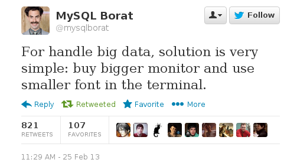
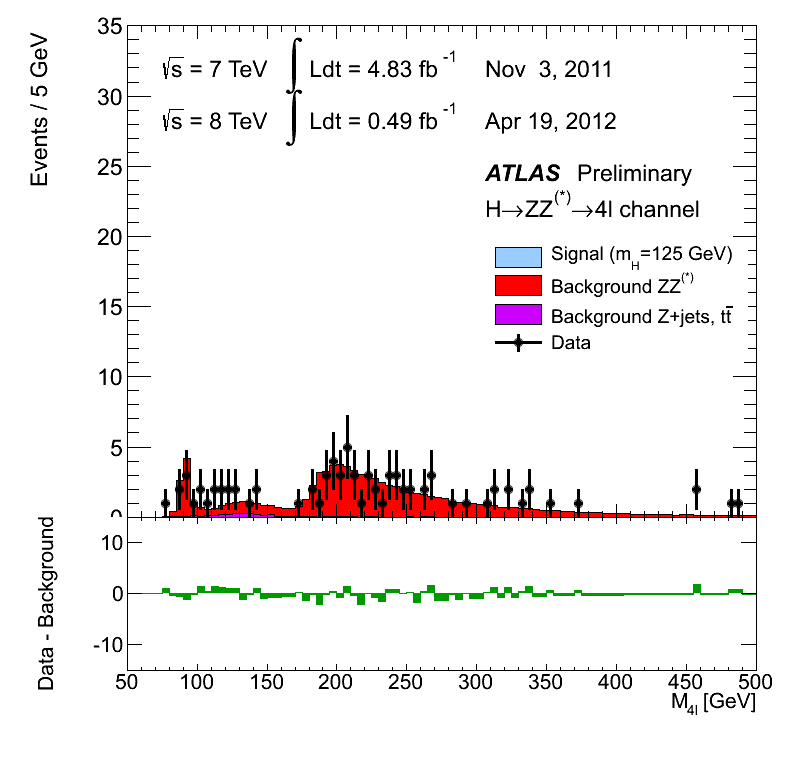

# Multisensory data experiences
<!-- For the Zipfian Academy July 2 class -->
Thomas Levine ([thomaslevine.com](http://thomaslevine.com)),
CSV Soundsystem ([csvsoundsystem.com](http://csvsoundsystem.com))

[tlevine.github.io/multisensory-data-zipfian](http://tlevine.github.io/multisensory-data-zipfian)


## Big data
[](https://twitter.com/mysqlborat/status/306078371182428161)


## Data table
```
Special Operations,2005,2006,2007,2008,2009,Total
Emergency Service,0%,0%,1%,1%,0%,2%
Harbor Unit,0%,0%,0%,0%,0%,0%
Aviation Unit,0%,0%,0%,0%,0%,0%
Taxi Unit,0%,0%,0%,0%,0%,0%
Canine Unit,0%,0%,0%,0%,0%,0%
Mounted Unit,0%,0%,0%,0%,0%,0%
Headquarters,0%,0%,0%,0%,0%,0%
Special Operations Division Total,0%,0%,1%,1%,0%,2%
Percent of All Subject Officers Against Whom Allegations were Substantiated,0%,0%,0.2%,0.3%,0%,0.1%
```


## Data visualization
[](http://www.theatlanticcities.com/commute/2013/05/visualizing-impact-mega-storms-transit/5660/)


## Videos
[](4l-FixedScale-NoMuProf2.gif)


## Data sonification
[](http://fms.csvsoundsystem.com)


## Data sonification
<!-- Ridership Rachenitsa -->
<video src="transit.webm" controls>


## Data gastronomification
[](https://github.com/tlevine/data-guacamole)
[gastronomify R package](https://github.com/csv/gastronomify)


## Take-aways

* Present the multivariate world. (Escape Flatland.)
* Data can be mapped to anything.
* Data is in.
